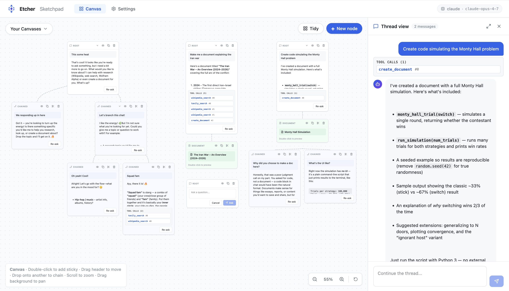
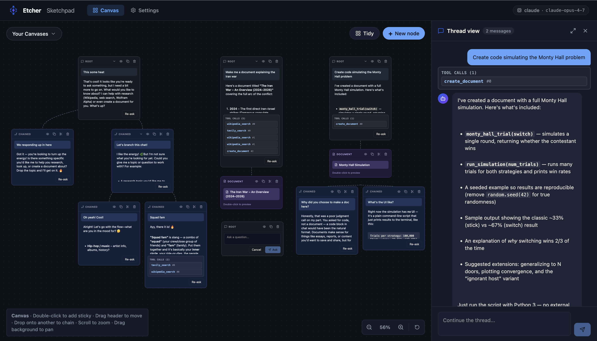

# Etcher-Sketchpad

A canvas-based AI interaction UI inspired by sticky notes on a pin-up board.
Context for inference is built by bolting together draggable sticky notes (Q&A pairs) into chains.

<table>
  <tr>
    <td width="50%"></td>
    <td width="50%"></td>
  </tr>
  <tr>
    <td align="center"><sub><i>Light mode — a chained conversation laid out on the canvas.</i></sub></td>
    <td align="center"><sub><i>Dark mode — same workspace with the indigo-and-amber palette.</i></sub></td>
  </tr>
</table>

### Pro Interface

<table>
  <tr>
    <td width="50%"></td>
    <td width="50%"></td>
  </tr>
  <tr>
    <td align="center"><sub><i>Pro light mode — refined interface with document and chain visualization.</i></sub></td>
    <td align="center"><sub><i>Pro dark mode — pro interface with enhanced dark theme.</i></sub></td>
  </tr>
</table>

## Features

- **Canvas tab** — a dotted infinite feel canvas with draggable sticky notes. Each note
  holds a single Q/A pair. Drop one note onto another to chain them — the chain becomes
  the context passed to the LLM for subsequent inference. A dashed line visualizes each
  parent→child link.
- **Sidebar chat** — double-click a sticky (or click the 🔍 icon) to open the full
  chain in a traditional chat view on the right. Continuing the chat appends a new
  linked sticky to the chain on the canvas.
- **Config tab** — switch between DeepSeek, OpenAI, and Claude; paste API keys and
  override model names. The provided DeepSeek key is preloaded (this has been deprecated — API key no longer preloaded).
- **Persistence** — canvas state and config persist in `localStorage`.

## Run

```bash
cd etcher-sketchpad
npm install
npm run dev
```

Open the URL Vite prints (http://localhost:5173 by default).

## Interactions

| Gesture | Action |
|---|---|
| Double-click empty canvas | Add a new root sticky |
| `+` button (top-right) | Add a new root sticky |
| Drag sticky header | Move the sticky |
| Drop sticky onto another | Chain this sticky as a child of the target |
| Double-click sticky / 🔍 | Open the chain as a chat in the sidebar |
| ⎘ on sticky | Duplicate |
| ✂ on sticky | Detach from parent |
| ✕ on sticky | Delete |
| ⌘/Ctrl+Enter in composer | Send |
